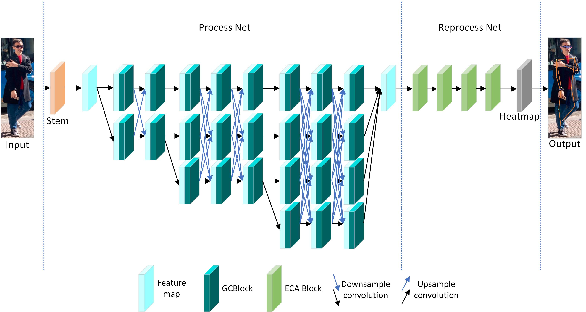

# PRLNet: A Two-Stage Lightweight Framework for Accurate Human Pose Estimation

The official code repository for the paper "PRLNet: A Two-Stage Lightweight Framework for Accurate Human Pose Estimation".


## Environment：
* Python3.7
* Pytorch1.10.1
* It is best to use GPU training
* For detailed environment configuration, see 'requirements.txt'(`pip install -r requirements.txt`)
 
## Data preparation：
* Official website of COCO dataset：https://cocodataset.org/
* You need to download three files of the coco2017 dataset：
    * 2017 Train images [118K/18GB]
    * 2017 Val images [5K/1GB]
    * 2017 Train/Val annotations [241MB]
* Unzip them all to the 'coco2017' folder, and you will get the following folder structure：
```
├── coco2017
     ├── train2017
     ├── val2017
     └── annotations
              ├── instances_train2017.json
              ├── instances_val2017.json
              ├── captions_train2017.json
              ├── captions_val2017.json
              ├── person_keypoints_train2017.json
              └── person_keypoints_val2017.json
```

## Training：
* Download the pre-trained weights from `https://pan.baidu.com/s/1KthVkSy2Kdxjpmyu6lRkkg?pwd=we7j` and place them in a folder.
* To use single GPU training, use the train.py training script directly
```
python train.py
```
* To use multi-GPU training, use the `torchrun --nproc_per_node=8 train_multi_GPU.py` command, where the `nproc_per_node` parameter is the number of GPUs used.

## Validation：
```
python validation.py
```

## predict：
```
python predict.py
```

## This project mainly refers to the following code base：
* https://github.com/WZMIAOMIAO/deep-learning-for-image-processing/tree/master/pytorch_keypoint/HRNet. Thank you very much for his contribution！
